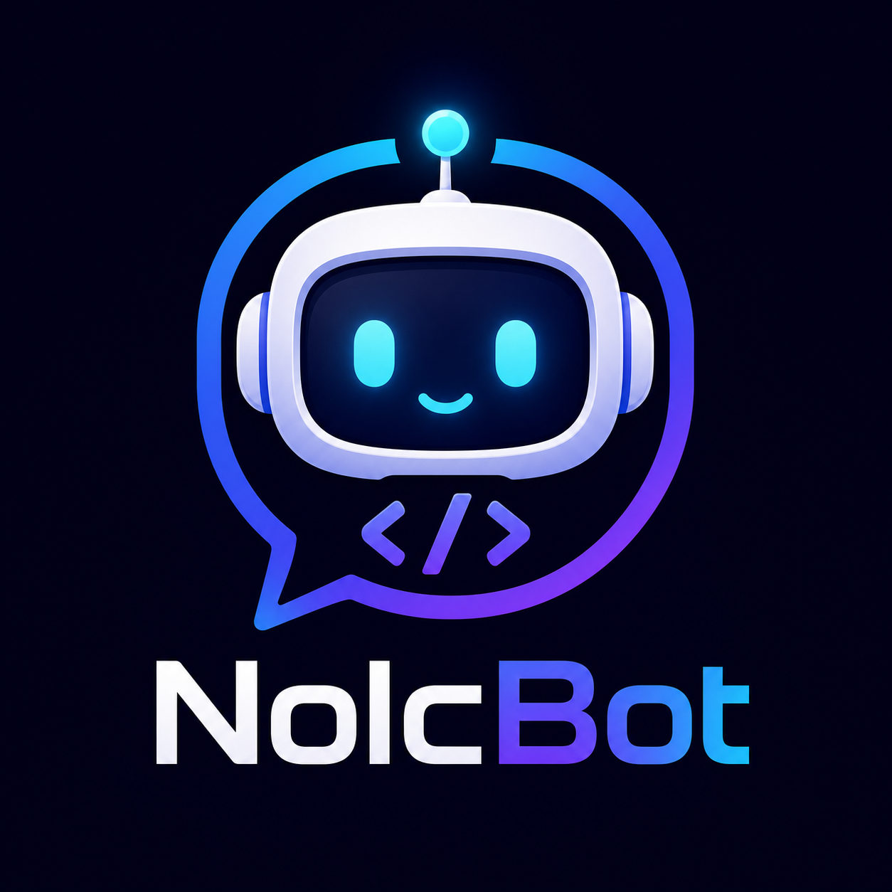

<p align="center">
  
</p>

<h1 align="center">NolcBot</h1>

<p align="center">
  Bot Discord modulaire écrit en <strong>Nolc</strong>, pensé pour les communautés sérieuses, les admins exigeants et les hébergeurs.
</p>

<p align="center">
  <a href="https://github.com/Noliae-France/NolcBot/actions/workflows/ci.yml"></a>
  <a href="https://github.com/Noliae-France/NolcBot/actions/workflows/discord-integration.yml"></a>
  <a href="https://github.com/Noliae-France/NolcBot/releases/tag/v0.1.0"></a>
  <a href="https://github.com/Noliae-France/NolcBot"></a>
  <a href="https://github.com/Noliae-France/NolcBot"></a>
  <a href="https://github.com/Noliae-France/NolcBot"></a>
  <a href="https://github.com/Noliae-France/NolcBot/actions/workflows/discord-integration.yml"></a>
  <a href="https://github.com/Noliae-France/NolcBot/actions/workflows/discord-integration.yml"></a>
</p>

<p align="center">
  <strong>🛡️ Modération</strong> · <strong>🎫 Tickets</strong> · <strong>🤖 IA</strong> · <strong>📊 Stats</strong> · <strong>🔌 Intégrations</strong> · <strong>🧰 Dashboard</strong>
</p>

---

NolcBot est un bot Discord natif basé sur le client [`nolc-discord`](https://github.com/Noliae-France/nolc-discord). Il vise une architecture propre : core léger, commandes par modules, configuration persistée en base, dashboard web, audit, automatisations, intégrations et assistants IA avec confirmation humaine pour les actions sensibles.

> L’édition de ce dépôt est le mode **OSS / self-host**. Le mode **SaaS** commercial avec licences payantes est décrit plus bas comme architecture cible séparée.

## ✨ Vision

NolcBot veut rester simple à héberger, mais sérieux techniquement : un bot modulaire, configurable depuis Discord ou le dashboard, avec audit, permissions, intégrations, assistants IA et CI/CD propre. L’objectif n’est pas d’avoir un gros fichier magique impossible à maintenir, mais un bot que l’on peut faire évoluer module par module.

## 🚀 Fonctionnalités clés

| Domaine | Ce que NolcBot apporte |
| --- | --- |
| 🛠️ Administration | ACL, groupes, rôles réels Discord, configuration SQLite, dashboard web |
| 🛡️ Modération | ban, kick, mute, warn, sanctions, notes privées, clear, slowmode, automod |
| 💬 Communauté | accueil, départs, FAQ, annonces, onboarding, idées d’événements |
| 🎫 Tickets | création, participants, fermeture, anti-abus et audit |
| 🤖 IA | ChatGPT/OpenAI, Gemini, Mistral, FAQ IA, assistant admin et assistant modération avec confirmation humaine |
| 🔌 Intégrations | Twitch, YouTube, GitHub, Reddit, RSS, calendriers, statut de site |
| 🧰 Utilitaires | profils, serveur, rôles, salons, avatar, QR, météo, traduction, rappels, timestamps |
| 🎲 Jeux & fun | dés, pile ou face, 8-ball, quiz, devinettes, memes, morpion, compatibilité |
| 📊 Observabilité | `/health`, `/metrics`, audit SQLite, rapports stats, artefacts CI |

## 🪶 Ultra léger

NolcBot est compilé en binaire natif Nolc : pas de runtime Node.js, pas de VM lourde, pas de framework géant embarqué. Le workflow `discord-integration` mesure la consommation réelle pendant un démarrage HTTP et une connexion Gateway Discord courte.

| Mode testé en CI | RAM max observée | CPU observé | Durée du test |
| --- | ---: | ---: | ---: |
| HTTP interactions | **6 MiB** | **0 %** | 8 s |
| Gateway Discord | **97 MiB** | **1 %** | 20 s |

Ces chiffres viennent du dernier run GitHub Actions d’intégration Discord avec `/usr/bin/time -v`. Le plafond RAM peut être rendu bloquant avec la variable GitHub `NOLCBOT_MAX_RSS_MB`.

## 🧱 Architecture rapide

```text
NolcBot
├─ core HTTP / Gateway Discord
├─ router de commandes
├─ modules métier
│  ├─ moderation, tickets, community, economy, fun
│  ├─ stats, utility, integrations, ai, forms, channels
│  └─ assistants IA admin / modération
├─ store SQLite self-host
├─ dashboard web
└─ scripts CI/CD, backup, restore, deploy systemd
```

Les seuls secrets obligatoires en environnement sont `DISCORD_APP_ID` et `DISCORD_BOT_TOKEN`. Le reste de la configuration serveur est stocké en SQLite et administrable sans modifier `.env`.

## ⚙️ CI/CD et releases

La CI publique est découpée pour garder des checks GitHub propres : `ci` est le check automatique obligatoire, tandis que `discord-integration` est un test manuel connecté à un vrai serveur Discord. Les anciens runs manuels peuvent être rouges dans l’historique si les secrets étaient absents ou en cours de configuration ; cela ne reflète pas l’état du build automatique.

Pipeline :

- [`ci`](.github/workflows/ci.yml) : sur push et pull request, vérifie qu’aucun secret brut n’est versionné, installe Nolc, compile, teste, publie un artefact Linux brut et prépare un paquet `nolcbot-linux-release-preview` pour valider le packaging avant release.
- [`discord-integration`](.github/workflows/discord-integration.yml) : lancement manuel uniquement, non bloquant pour les push/PR. Il utilise les **GitHub Secrets** pour tester SQLite, l’API Discord, l’application, le serveur de test, la présence du bot, l’enregistrement des commandes, une connexion Gateway courte, les actions Discord réelles, la mesure RAM/CPU et OpenAI si la clé est fournie.
- [`release`](.github/workflows/release.yml) : sur tag `v*`, recompile, reteste, prépare l’artefact Linux et crée une GitHub Release.

📦 Dernière release publiée :

- [`v0.1.0`](https://github.com/Noliae-France/NolcBot/releases/tag/v0.1.0)
- Asset Linux : `nolcbot-linux`
- Checksum : `nolcbot-linux.sha256`

🔐 Secrets GitHub attendus pour le smoke test Discord :

| Secret GitHub | Usage |
| --- | --- |
| `DISCORD_APP_ID` | Identifiant d’application Discord |
| `DISCORD_BOT_TOKEN` | Token du bot, masqué par GitHub Actions |
| `DISCORD_PUBLIC_KEY` | Clé publique Discord injectée dans SQLite pendant le test |
| `DISCORD_TEST_GUILD_ID` | Serveur Discord de test |
| `DISCORD_CLIENT_ID` | OAuth2, futur dashboard complet |
| `DISCORD_CLIENT_SECRET` | OAuth2, futur dashboard complet |
| `OPENAI_API_KEY` | Tests IA optionnels |

Ne jamais écrire ces valeurs dans le repo, dans les logs, dans le README ou dans un fichier `.env` versionné. Si une clé a été partagée en clair, elle doit être régénérée avant usage.

🏷️ Créer une release :

```sh
git tag -a v0.2.0 -m "NolcBot v0.2.0"
git push origin v0.2.0
```

## 🔄 Mises à jour GitHub

NolcBot sait vérifier les releases GitHub depuis Discord :

- `/update_check` compare la version locale avec la dernière release publiée sur [`Noliae-France/NolcBot`](https://github.com/Noliae-France/NolcBot/releases) ;
- `/update_plan` affiche la procédure serveur sécurisée pour les admins.

La mise à jour réelle du binaire se fait côté serveur avec checksum et backup :

```sh
./scripts/update_from_github.sh
```

Variables optionnelles :

| Variable | Défaut | Usage |
| --- | --- | --- |
| `NOLCBOT_VERSION` | `v0.2.0-dev` | Version affichée par `/version` et `/update_check` |
| `NOLCBOT_UPDATE_REPO` | `Noliae-France/NolcBot` | Dépôt GitHub source des releases |
| `NOLCBOT_UPDATE_ASSET` | `nolcbot-linux` | Asset Linux à installer |
| `NOLCBOT_INSTALL_PATH` | `./bot` | Chemin du binaire à remplacer |
| `NOLCBOT_SYSTEMD_SERVICE` | vide | Service systemd à redémarrer après installation |

Exemple prod :

```sh
NOLCBOT_INSTALL_PATH=/opt/nolcbot/bot \
NOLCBOT_SYSTEMD_SERVICE=nolcbot.service \
./scripts/update_from_github.sh
```

Le script refuse l’installation si `nolcbot-linux.sha256` ne correspond pas au binaire téléchargé. Le bot ne s’auto-remplace pas directement depuis une commande Discord : c’est volontaire, pour éviter qu’une commande compromise puisse exécuter du code distant sans contrôle serveur.

## 🐧 Build Linux

`./build.sh` détecte Linux (`pkg-config` ou chemins système). Dépendances requises : Nolc, OpenSSL 3, libsodium et SQLite3.

```sh
# Debian / Ubuntu
sudo apt-get install libsodium-dev libssl-dev libsqlite3-dev pkg-config

./build.sh
```

Pour vérifier l’installation complète :

```sh
./check.sh
```

Commandes disponibles : commandes générales (`/help`, `/ping`, `/about`, `/hello`, `/echo`), jeux (`/roll`, `/coin`, `/8ball`, `/pfc pierre|feuille|ciseaux`, `/joke`, `/meme`, `/meme_add`, `/meme_remove`, `/meme_list`, `/quote`, `/riddle`, `/quiz`, `/challenge`, `/morpion`, `/compatibility`, `/choose`), vocal (`/voice create`, `/voice delete`), utilitaires (`/calc`, `/convert`, `/timestamp`, `/timezone`, `/password`, `/define`, `/qr`, `/weather`, `/remind`), informations (`/userinfo`, `/serverinfo`, `/roleinfo`, `/channelinfo`, `/avatar`), configuration ACL, rôles, signalements et modération.

Les formulaires natifs Discord sont disponibles avec `/form_create nom titre question`, puis `/form_open nom`. Seuls les administrateurs peuvent créer ou remplacer un formulaire ; chaque réponse est envoyée dans le salon où le formulaire a été créé et est auditée.

`/choose option1|option2|option3` choisit aléatoirement parmi les options fournies. Le séparateur `|` permet de conserver les espaces dans chaque proposition.

`/morpion nouveau` crée une partie persistante dans le salon courant, puis `/morpion jouer case` joue une case de 1 à 9 contre le bot.

Les administrateurs peuvent modifier un salon avec `/channel_edit salon champ valeur`. Les champs pris en charge sont `name`, `topic`, `slowmode`, `nsfw`, `category` et `position`. `/channel_sync_config salon clé` associe directement un salon ou une catégorie à une clé SQLite du bot comme `welcome_channel`, `reports.channel`, `log.channel`, `voice.temp_category` ou `ticket.category_id`.

`/timezone decalage` affiche l’heure correspondant à un décalage UTC de -12 à +14. `/password longueur` génère un mot de passe éphémère de 8 à 64 caractères; pour un secret critique, utiliser un gestionnaire dédié.

`/define mot` interroge ponctuellement l’API publique Dictionary API pour une définition en anglais. Le mot est limité à 64 caractères alphabétiques et n’est pas conservé par le bot.

## 🏗️ Compiler

```sh
nolc pkg install
nolc build . -o bot
```

## 🔧 Configurer Discord

Variables utilisées : `DISCORD_APP_ID` et `DISCORD_BOT_TOKEN`. La clé publique Discord est conservée dans SQLite après `./bot setup-public-key <cle>`.

Copier `.env.example` vers un fichier local non versionné et renseigner les valeurs. Pour vérifier l’installation complète :

```sh
./check.sh
```

### 🔒 Sécurité et données

- Ne jamais versionner `.env`, tokens, clés IA, webhooks ou bases SQLite de production.
- Les clés contenant `token`, `secret`, `password`, `private`, `credential`, `api_key` ou `webhook` sont refusées côté commandes/dashboard lorsqu’elles ne doivent pas être exposées.
- Les commandes sensibles sont auditées dans SQLite.
- Les routes dashboard/admin exigent un secret dashboard suffisamment long.
- Les données personnelles activées par le bot peuvent être exportées ou supprimées avec les commandes dédiées.
- Les appels IA, traduction, météo, QR et intégrations externes peuvent transmettre le contenu demandé au fournisseur configuré.

### 🚢 Déploiement recommandé

- utilisateur système dédié ;
- reverse proxy HTTPS devant l’endpoint Discord ;
- sauvegardes SQLite régulières avec `backup.sh` ;
- restauration contrôlée avec `restore.sh` ;
- surveillance via `/health` et `/metrics` ;
- GitHub Actions vert avant mise en production.

## 💼 Mode SaaS pour hébergeurs

L’édition présente dans ce dépôt correspond au mode **OSS / self-host** : elle permet d’héberger soi-même un bot dédié, avec SQLite, sans plateforme commerciale intégrée.

Le mode **SaaS** est une édition commerciale séparée, destinée aux hébergeurs de bots Discord, plateformes communautaires ou offres managées. Il n’est pas gratuit : chaque client, serveur ou offre hébergeur doit être couvert par une licence active. L’objectif est de fournir un bot mutualisé, piloté depuis un dashboard unique, tout en isolant proprement chaque serveur Discord et chaque client.

🧩 Principes du mode SaaS proposé :

- **Base de données PostgreSQL** : remplacer l’adaptateur SQLite local par un stockage PostgreSQL centralisé, compatible multi-instance, migrations contrôlées, sauvegardes automatisées et restauration par tenant.
- **Bot mutualisé** : un même processus ou cluster Noliae peut servir plusieurs serveurs Discord, avec une configuration séparée par `guild_id` et, si nécessaire, par `tenant_id` hébergeur.
- **Système de licences payantes** : activation par clé de licence, abonnement, quota de serveurs, quota de membres, modules autorisés, date d’expiration, statut suspendu/actif et vérification périodique côté serveur SaaS.
- **Chiffrement des données** : les secrets clients, clés API IA, webhooks, intégrations Twitch/YouTube/GitHub/Reddit/RSS et données sensibles doivent être chiffrés au repos, masqués dans le dashboard et audités à chaque modification.
- **Dashboard unique** : une interface web centralisée permet de gérer les serveurs, modules, ACL, rôles, salons, tickets, overlays, IA, intégrations, statistiques et journaux sans modifier `.env`.
- **Isolation client** : chaque client ne voit que ses serveurs, ses configurations et ses exports. Les opérateurs hébergeur disposent d’un rôle support séparé avec journalisation stricte.
- **Scalabilité** : le mode SaaS doit prévoir workers Gateway, workers de notifications, file d’attente pour les actions massives, cache applicatif et métriques Prometheus par tenant.
- **Conformité et sécurité** : suppression des données personnelles sur demande, politique de conservation, rotation des secrets, quotas par offre et exports contrôlés.

💳 Modèle de licence cible :

- **OSS / self-host** : utilisation autonome, base SQLite, dashboard local, configuration par serveur, sans garantie commerciale ni infrastructure mutualisée.
- **SaaS Starter** : licence payante pour petites communautés, nombre limité de serveurs/membres, modules essentiels, dashboard hébergé.
- **SaaS Pro** : limites plus hautes, intégrations externes avancées, IA, statistiques étendues, overlays personnalisés et support prioritaire.
- **SaaS Host / Enterprise** : offre pour hébergeurs, multi-clients, PostgreSQL dédié ou mutualisé, SSO, marque blanche, SLA, audit avancé et quotas personnalisés.

🏢 Architecture cible :

- `DISCORD_APP_ID` et `DISCORD_BOT_TOKEN` restent des secrets d’infrastructure, jamais configurables depuis Discord.
- Toutes les autres options serveur sont stockées en base, modifiables depuis Discord ou depuis le dashboard.
- Les tables métier doivent être scopées par serveur Discord, et les tables SaaS ajoutent un niveau propriétaire/client lorsque l’hébergeur gère plusieurs clients.
- Les tables de licence doivent gérer les clients, plans, clés, limites, expirations, suspensions, paiements et événements d’audit.
- L’authentification du dashboard SaaS doit utiliser OAuth Discord ou le SSO de l’hébergeur, avec rôles `owner`, `admin`, `support` et `viewer`.

Statut actuel : l’édition OSS/self-host utilise SQLite et convient à un bot dédié. Le mode SaaS payant est une cible d’architecture à implémenter via un adaptateur PostgreSQL, un serveur de licences, une authentification utilisateur complète, le chiffrement applicatif des secrets et des migrations multi-tenant.

Sauvegarder et restaurer la base :

```sh
./backup.sh
./restore.sh backups/noliae-YYYYMMDDTHHMMSSZ.sqlite3
```

En production, `deploy/noliae-backup.service.example` et `deploy/noliae-backup.timer.example` fournissent un timer systemd quotidien avec rattrapage après redémarrage.

## 🧑‍⚖️ ACL par rôles Discord

Le contrôle des permissions est actif pour les commandes de modération. Le propriétaire du serveur est toujours autorisé. Pour un premier déploiement, associez les permissions aux identifiants de rôles Discord réels via les variables dédiées :

Après l’installation, les rôles peuvent être enregistrés directement dans SQLite depuis Discord avec `/aclrole permission rôle` (par exemple `/aclrole ban @Modo`). La configuration en base prend priorité sur les variables `.env`; celles-ci restent un secours de bootstrap.

```sh
export NOLIAE_MODO_ROLE_ID=ID_ROLE_MODO
export NOLIAE_ADMIN_ROLE_ID=ID_ROLE_ADMIN
# IDs propriétaires séparés par des virgules, si le payload Discord ne contient pas guild_owner_id
export NOLIAE_OWNER_USER_IDS=ID_UTILISATEUR_PROPRIETAIRE
```

Les commandes protégées comprennent `/ban`, `/ban_temp`, `/kick`, `/unban`, `/warn`, `/warnings`, `/sanctions`, `/note`, `/clear`, `/slowmode`, `/mute` et `/unmute`. Les groupes et permissions se configurent avec `/groupe` et `/permission` puis sont persistés dans SQLite ; une permission peut être partagée par plusieurs groupes/rôles. Chaque avertissement reçoit un identifiant unique d’audit. `/sanctions membre` affiche les 20 dernières sanctions détaillées. `/ban_temp` programme le débannissement via SQLite pour 60 secondes à 28 jours, y compris après redémarrage. `/note ajouter|voir|supprimer` gère une note privée par membre et par serveur. `/mute` accepte une durée de 1 seconde à 28 jours et calcule la date ISO 8601 requise par Discord. `/clear` accepte aussi `quantite` de 2 à 100 pour supprimer un lot de messages récents via l’API bulk-delete Discord.

Les sanctions progressives s’activent avec `/config moderation.warn_threshold 3` et `/config moderation.warn_timeout_seconds 600`. Le timeout est appliqué automatiquement au troisième avertissement, par exemple.

Pour les rôles auto-attribuables, l’administrateur utilise `/roleconfig rôle actif:true`, puis les membres disposent de `/role ajouter rôle` et `/role retirer rôle`. La configuration est propre à chaque serveur et toutes ces opérations sont inscrites dans l’audit SQLite.

Synchronisation automatique des commandes :

```sh
DISCORD_APP_ID=... DISCORD_BOT_TOKEN=... ./bot gateway
```

Au démarrage Gateway, NolcBot reçoit la liste des serveurs Discord via `READY`, mémorise chaque `guild_id` dans SQLite puis publie automatiquement les commandes slash sur chaque serveur. Quand le bot rejoint un nouveau serveur, l’événement `GUILD_CREATE` déclenche aussi la synchronisation automatiquement.

Discord limite les commandes slash d’une application à **100 commandes par scope**. NolcBot garde un catalogue interne plus large, mais l’auto-sync publie un lot Discord priorisé par modules via `./bot commands-json-discord`. Les commandes visibles dans le `/help` principal sont incluses dans ce lot, notamment `/setup`, `/ban`, `/ticket`, `/ai`, `/modules`, `/permission`, `/youtube_subscribe`, `/daily`, `/quiz`, `/morpion`, `/weather`, `/remind`, `/update_check` et `/update_plan`.

Pour éviter les vieilles commandes globales qui traînent, NolcBot purge automatiquement les commandes globales au premier démarrage après un changement de catalogue, puis utilise les commandes serveur, beaucoup plus rapides à propager.

Réglages avancés :

```sh
NOLIAE_AUTO_SYNC_COMMANDS=false ./bot gateway
NOLIAE_AUTO_CLEAR_GLOBAL_COMMANDS=false ./bot gateway
```

Les mêmes options peuvent être pilotées via SQLite :

- `discord.auto_sync_commands=false`
- `discord.auto_clear_global_commands=false`

Commandes de secours pour debug/CI :

- `./bot register` : remplace les commandes globales compatibles Discord ;
- `./bot register-guild ID_SERVEUR` : remplace les commandes d’un serveur ;
- `./bot clear-guild-commands ID_SERVEUR` : supprime les commandes d’un serveur ;
- `./bot clear-global-commands` : supprime les commandes globales, propagation Discord plus lente ;
- `./bot sync-guild ID_SERVEUR` : purge puis ré-enregistre immédiatement le serveur.

Après l’auto-sync, `/setup` ouvre le guide de configuration rapide directement dans Discord sans action manuelle.

Les réponses visibles principales utilisent des **embeds Discord** : `/help`, `/setup`, `/ping`, `/userinfo`, `/serverinfo`, ainsi que les messages d’accueil et de départ envoyés par le Gateway. Les textes `welcome_message` et `goodbye_message` restent personnalisables par serveur depuis SQLite/dashboard.

Démarrer l’endpoint d’interactions :

```sh
./bot setup-public-key VOTRE_CLE_PUBLIQUE_DISCORD
./bot
```

Le serveur doit être placé derrière HTTPS pour l’URL d’interactions Discord.
Une page de supervision est disponible sur `/dashboard`; les superviseurs Prometheus peuvent utiliser `/metrics`. Les métriques exposent notamment l’état du processus, l’intégrité SQLite, la version de schéma, l’âge du dernier tick Gateway, le nombre de serveurs connus et le volume de commandes sur la dernière heure. L’API authentifiée `GET /admin/guilds` liste les serveurs persistés, `GET /admin/config?guild=ID` liste les clés non sensibles d’un serveur, tandis que `POST /admin/config` permet de modifier une clé autorisée. Le dashboard propose aussi l’activation/désactivation directe des modules par serveur. Toutes ces routes exigent `X-Noliae-Admin`.

Le dashboard inclut un **Overlay Studio** pour créer des overlays Discord/OBS/Streamlabs par serveur. L’URL publique `/overlay?guild=ID_DU_SERVEUR&type=stream` est utilisable comme source navigateur, avec plusieurs types disponibles : `stream`, `welcome`, `stats`, `tickets` et `moderation`.

Les clés `overlay.template`, `overlay.title`, `overlay.subtitle`, `overlay.accent`, `overlay.accent_secondary`, `overlay.background`, `overlay.position`, `overlay.width` et `overlay.opacity` sont stockées en SQLite. Le dashboard permet de les modifier sans toucher au `.env`.

En mode Gateway, les salons d’accueil et de départ sont configurables avec `NOLIAE_WELCOME_CHANNEL_ID` et `NOLIAE_GOODBYE_CHANNEL_ID`.
Les clés serveur `welcome_channel`, `goodbye_channel`, `welcome_message`, `goodbye_message` et `auto_role` configurées avec `/config` sont prioritaires sur ces valeurs globales.

Pour recevoir les arrivées/départs, activer aussi l’intent privilégié **Server Members Intent** dans le portail développeur Discord. Le contenu des messages nécessite **Message Content Intent**.

Les commandes slash, messages Gateway, arrivées/départs et actions sensibles sont enregistrés dans la table SQLite `audit_log`. `/health` vérifie aussi l’intégrité SQLite, le dernier tick Gateway et le volume de commandes récent. `/stats` expose ces compteurs par serveur; aucune donnée de contenu de message n’est conservée. Les administrateurs peuvent aussi utiliser `/stats_report jour`, `/stats_report semaine` ou `/stats_report mois` pour obtenir une synthèse calculée sur une fenêtre temporelle.

Les notifications peuvent être séparées avec `NOLIAE_MOD_LOG_CHANNEL_ID`, `NOLIAE_SECURITY_LOG_CHANNEL_ID` et `NOLIAE_COMMUNITY_LOG_CHANNEL_ID`. Chaque catégorie revient automatiquement vers `NOLIAE_LOG_CHANNEL_ID` si son salon dédié n’est pas défini.
Elles peuvent aussi être choisies serveur par serveur avec `/config log.channel ID`, `/config log.moderation_channel ID`, `/config log.security_channel ID` et `/config log.community_channel ID`; ces réglages persistants prennent priorité sur l’environnement.

Un administrateur peut exporter les 100 dernières actions avec `/logs_csv`; l’export est limité et rendu dans une réponse privée.

Le Gateway suit les entrées et sorties vocales via `VOICE_STATE_UPDATE`. Ces événements sont audités, le temps passé est cumulé par utilisateur, et les compteurs/secondes apparaissent dans `/stats` et `/stats_csv` ; cela ne fournit pas encore de lecture audio.

Le client REST respecte les réponses `429` de Discord : il lit `Retry-After`, attend au plus 10 secondes et effectue une seule nouvelle tentative, en plus de la reprise réseau bornée.

Les événements `MESSAGE_UPDATE` et `MESSAGE_DELETE` reçus dans un serveur sont également inscrits dans l’audit SQLite avec le salon et l’identifiant du message ; le contenu supprimé n’est jamais inventé lorsqu’il n’est pas fourni par Discord.

Le même audit couvre les changements de membres, bans/débans, créations/suppressions de salons et créations/suppressions de rôles lorsque les intents Discord correspondants sont disponibles.

Les salons vocaux temporaires sont disponibles avec `/voice create nom` et `/voice delete salon`. La clé `voice.temp_category` permet de choisir la catégorie Discord de création. La suppression est réservée aux administrateurs et limitée aux salons enregistrés par le bot ; le dernier départ déclenche aussi une suppression automatique. Les présences sont persistées et chaque opération est auditée.

Pour recevoir les synthèses statistiques automatiquement, configurez `/config reports.channel ID_DU_SALON`. Les rapports quotidien, hebdomadaire et mensuel sont persistés et ne sont pas renvoyés en double après redémarrage.

La file musicale persistante est disponible avec `/music add URL`, `/music list`, `/music skip`, `/music stop`, `/music loop`, `/music shuffle`, `/music vote` et `/music status`. Le seuil de vote est configurable avec `music.vote_threshold` (3 par défaut), et un membre ne vote qu’une fois par piste. Les entrées sont conservées par serveur dans SQLite et limitées à 50 URL HTTP(S). La lecture réelle nécessite encore l’adaptateur UDP/Opus vocal ; le bot n’affiche pas une lecture comme active tant que cet adaptateur n’est pas configuré.

En cas de coupure Gateway ou de silence prolongé, le client ferme la session et se reconnecte automatiquement avec un délai progressif d’une à trente secondes.

Une première intégration webhook Discord est disponible avec `NOLIAE_WEBHOOK_URL` et `/webhook_test message`. L’URL reste uniquement dans l’environnement, est validée pour `discord.com/api/webhooks/` et n’est jamais stockée dans SQLite.
Les administrateurs peuvent consulter les invitations actuelles avec `/invites` : code, nombre d’utilisations et créateur sont lus directement depuis Discord. Les utilisations observées sont mémorisées dans `invite_cache` et les augmentations sont auditées ; l’attribution automatique d’une arrivée et la détection avancée des invitations suspectes restent à compléter.
`/invite_stats` affiche le classement des créateurs selon les nouvelles utilisations observées.
Pour automatiser l’observation, un administrateur peut activer `/config invites.tracking true`; le bot interroge alors les invitations toutes les cinq minutes sur les ticks Gateway.

Les invitations sans créateur Discord identifiable ou dont le compteur revient en arrière sont journalisées comme `invite_suspect`. Ce sont des alertes de modération et non une preuve définitive de fraude.
Les partenariats disposent d’un workflow persistant : `/partnership proposer nom lien description`, puis les administrateurs utilisent `/partnership lister`, `/partnership accepter id` ou `/partnership refuser id`.
Avec `/config partnership.channel ID_SALON`, les partenariats acceptés sont publiés automatiquement dans le salon choisi.

`/site_status https://exemple.fr/` réalise une vérification HTTPS ponctuelle. Les URL HTTP, les hôtes locaux évidents, les adresses privées usuelles, les identifiants intégrés et les URL de plus de 2048 caractères sont refusés ; la commande ne conserve pas l’URL.

`/calendar URL_ICS` lit ponctuellement le prochain événement d’un calendrier iCalendar HTTPS public. Les administrateurs peuvent aussi utiliser `/calendar_subscribe` et `/calendar_unsubscribe` : jusqu’à cinq calendriers sont conservés par serveur et vérifiés périodiquement pour notifier les nouveaux titres dans le salon choisi.

`/rss https://exemple.fr/flux.xml` lit le premier titre d’un flux RSS HTTPS public. Les mentions contenues dans le titre sont neutralisées ; le bot ne conserve pas le flux et les appels restent soumis au rate-limit des commandes.

Les notifications persistantes sont disponibles pour YouTube (`/youtube_subscribe channel_id` avec un identifiant `UC...`), GitHub (`/github_subscribe organisation/projet`) et Reddit (`/reddit_subscribe subreddit`). YouTube utilise le flux officiel de la chaîne et publie un message dédié `Nouvelle vidéo YouTube` quand le dernier titre change. `/youtube_list` liste les chaînes suivies. La désinscription se fait avec `/rss_unsubscribe URL`.

`/twitch_status chaine` interroge ponctuellement Twitch Helix. `/twitch_subscribe chaine`, `/twitch_unsubscribe chaine` et `/twitch_list` gèrent les notifications persistantes de passage en direct. Quand une chaîne passe hors-ligne puis live, le bot publie le lien direct `https://www.twitch.tv/chaine` dans le salon configuré. Ils nécessitent les clés SQLite `_system.integration.twitch.client_id` et `_system.integration.twitch.app_token`.

Les administrateurs peuvent abonner le salon courant avec `/rss_subscribe url` et retirer l’abonnement avec `/rss_unsubscribe url`. Jusqu’à 10 flux sont suivis par serveur, contrôlés au plus toutes les cinq minutes sur les événements Gateway, et chaque dernier titre est mémorisé pour éviter les doublons.

Chaque serveur peut gérer sa FAQ avec `/faq ajouter question reponse`, `/faq voir question`, `/faq lister` et `/faq supprimer question`. Les réponses sont persistantes, propres au serveur et accessibles sans modifier le code ; la gestion nécessite la permission `admin`.

`/faq_ai question` recherche dans les entrées FAQ du serveur avec l’adaptateur IA configuré, respecte `ai.enabled` et partage la limite de cinq requêtes IA par minute.

L’assistant communauté ajoute `/community_event_ideas sujet`, `/community_faq_ai_add question contexte`, `/community_announce_ai salon sujet`, `/community_rules ton salon`, `/community_onboarding salon public` et `/community_confirm`. Les idées d’événements répondent directement; les annonces, règles et onboarding générés par IA restent en brouillon SQLite et ne sont publiés qu’après confirmation admin.

`/weather ville` interroge ponctuellement `wttr.in` en HTTPS. Les villes sont limitées et filtrées ; la réponse n’est pas persistée.

`/ai question` utilise le fournisseur configuré avec `/ai_config fournisseur api_key modele` (`openai`, `gemini` ou `mistral`). Les réglages sont stockés par serveur dans SQLite, la question est limitée à 2000 caractères, la réponse à 1800 caractères et chaque utilisateur est limité à 5 requêtes par minute ; sans configuration, la commande est désactivée.
Un administrateur peut désactiver l’IA par serveur avec `/config ai.enabled false`.
Les commandes `/summarize texte`, `/rewrite texte` et `/ideas sujet` utilisent le même adaptateur, les mêmes limites et la même politique de désactivation ; elles ne conservent pas le contenu envoyé.

L’assistant de modération IA ajoute `/ai_mod_alert membre contexte`, `/ai_mod_incident contexte` et `/ai_mod_confirm`. Il explique l’alerte, résume l’incident et propose au maximum une sanction (`warn`, timeout, kick ou ban) ; rien n’est appliqué tant qu’un modérateur autorisé n’a pas confirmé. La proposition en attente est stockée temporairement dans SQLite puis supprimée après confirmation.

`/translate texte langue` utilise un endpoint HTTPS LibreTranslate-compatible configuré par `NOLIAE_TRANSLATE_URL` et, si nécessaire, `NOLIAE_TRANSLATE_API_KEY`. Le texte est limité à 1500 caractères, chaque utilisateur à 10 requêtes par minute, et `/config translate.enabled false` désactive le service par serveur.

`/qr texte` fournit un lien vers une image QR générée par `api.qrserver.com`. Le contenu est limité à 500 caractères, n’est pas stocké par Noliae et est soumis à la disponibilité du service tiers.

Le schéma SQLite courant est la version 2. Les tables sont créées avec `IF NOT EXISTS`, ce qui permet aux bases version 1 d’être reprises automatiquement au démarrage sans écraser leur configuration.

L’automodération des invitations, liens, mentions massives et messages majoritairement en majuscules peut être activée par serveur avec `/config automod.invites true`, `/config automod.links true`, `/config automod.mentions true` et `/config automod.caps true`. Le filtre majuscules exige au moins 8 lettres et 70 % de majuscules ; le filtre mentions agit à partir de 5 mentions. Les variables `NOLIAE_AUTOMOD_INVITES=1` et `NOLIAE_AUTOMOD_LINKS=1` servent de valeurs globales par défaut.

Une liste personnalisée de termes peut être définie avec `/config automod.banned_words terme1,terme2`. Les messages contenant un terme sont supprimés et journalisés ; la liste reste propre à chaque serveur.

La détection des doublons consécutifs s’active avec `/config automod.duplicates true`. Pour cette comparaison, le bot conserve uniquement le dernier message de 500 caractères maximum par utilisateur et par serveur.

Une liste noire globale peut être définie avec `NOLIAE_BLACKLIST_GUILD_IDS` (IDs séparés par des virgules). Les commandes de ces serveurs sont refusées avant tout traitement métier.

Les comptes bloqués peuvent être listés avec `NOLIAE_BLACKLIST_USER_IDS` (IDs séparés par des virgules).

Les listes blanches `NOLIAE_WHITELIST_GUILD_IDS` et `NOLIAE_WHITELIST_USER_IDS` prennent priorité pour les environnements de test et les comptes de confiance.

Le mode maintenance global s’active avec `NOLIAE_MAINTENANCE=1`. Seule `/health` reste disponible pour la supervision.
Le mode maintenance par serveur s’active avec `/config maintenance true` et se désactive avec `/config maintenance false`. Les administrateurs du serveur peuvent encore utiliser les commandes de configuration pour sortir de maintenance.

L’anti-raid est configurable par serveur avec `/config raid.join_limit 10` et `/config raid.window_seconds 60`. Au-delà du seuil, les nouvelles arrivées ne déclenchent ni rôle automatique ni message d’accueil et sont journalisées comme `raid_block`; la valeur `0` ou l’absence de configuration désactive la protection. Pour expulser automatiquement les arrivées bloquées, définir `/config raid.action kick`; le mode par défaut reste `passive`.

L’anti-spam se configure par serveur avec `/config antispam.max_messages 5` et `/config antispam.window_seconds 10`. Les messages excédentaires sont supprimés et audités; `max_messages=0` ou l’absence de réglage désactive la règle.

Le rate-limit des commandes se configure avec `/config ratelimit.max_commands 5` et `/config ratelimit.window_seconds 10`. Il protège chaque utilisateur des abus de commandes et reste désactivé par défaut.

La progression communautaire est opt-in : `/config xp.enabled true` active un point par message et `/profile` affiche XP, niveau et badge. `/config xp.enabled false` désactive l’attribution; les scores restent dans la base jusqu’à suppression des données. `/xp_leaderboard` affiche le meilleur score et `/xp_reset membre` permet à un administrateur de réinitialiser un membre. Le multiplicateur, les exclusions par salon/rôle et le délai anti-farm sont configurables.

`/data_export` fournit en réponse privée les données personnelles persistées sur le serveur courant : XP, économie, temps vocal, note et inventaire. La commande ne peut exporter que les données de l’utilisateur appelant.

Un rôle de récompense peut être configuré par niveau avec `/config xp.role.5 ID_ROLE_DISCORD`. Lorsque l’utilisateur atteint le niveau 5, le bot lui attribue ce rôle réel si ses permissions Discord le permettent.

Pour le vocal, `/config voice.role_seconds 3600` et `/config voice.role_id ID_ROLE_DISCORD` attribuent le rôle après une heure cumulée en vocal. Le suivi reste limité aux événements `VOICE_STATE_UPDATE` ; aucune lecture audio n’est fournie.

L’économie virtuelle est disponible par serveur avec `/balance`, `/daily`, `/weekly`, `/work`, `/shop`, `/buy`, `/inventory`, `/transactions`, `/pay` et `/leaderboard`. Les soldes sont persistés dans SQLite; la récompense quotidienne vaut 100 pièces avec un cooldown de 24 heures, la récompense hebdomadaire 500 pièces avec un cooldown de 7 jours, `/work` rapporte aléatoirement 50 à 200 pièces avec un cooldown d’une heure, et les achats sont atomiques et persistés dans l’inventaire. `/transactions` affiche les 10 dernières opérations du demandeur. Les transferts ne peuvent pas créer de solde négatif. L’XP et les succès sont visibles avec `/profile` et `/achievements`.

Les administrateurs peuvent publier un sondage Oui/Non avec `/poll question`; la publication est envoyée via l’API Discord et inscrite dans l’audit.

Les rappels personnels utilisent `/remind secondes texte`, `/remind_repeat secondes texte` pour une récurrence, `/reminders` pour lister ses rappels et `/remind_cancel id` pour en annuler un. Ils sont persistés dans SQLite et livrés par le scheduler Gateway; limite : 30 jours. Seul le créateur peut annuler son rappel.

Le préfixe des commandes texte Gateway est personnalisable par serveur avec `/config prefix ?` (par exemple `?`). Il revient à `NOLIAE_PREFIX`, puis à `!` si aucune valeur n’est définie. Les commandes slash ne dépendent pas de ce réglage.

Le support utilise `/ticket sujet`, `/ticket_add membre`, `/ticket_remove membre` et `/ticket_close`. Le salon est privé par défaut; `NOLIAE_TICKET_CATEGORY_ID` permet de choisir sa catégorie et `NOLIAE_TICKET_STAFF_ROLE_ID` d’autoriser le rôle de support. Le bot doit avoir `Manage Channels` et `Manage Permissions` pour modifier les participants.

Une limite anti-abus peut être activée avec `/config tickets.max_per_day 2`; elle s’applique à chaque utilisateur sur une fenêtre glissante de 24 heures.
